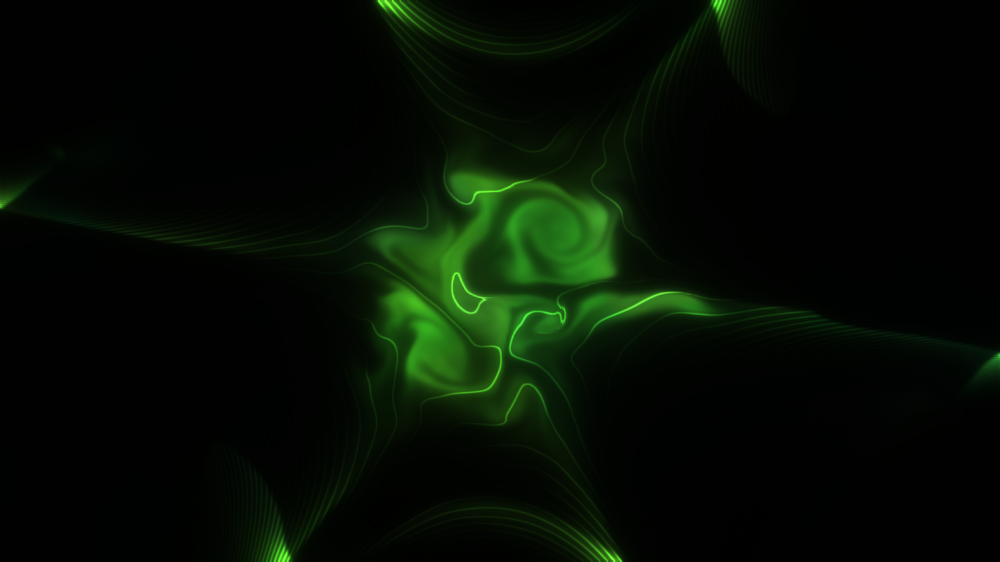

# containment

> **AI-assisted project.** This codebase was created with [Claude](https://claude.com/claude-code)
> (Anthropic), directed and reviewed by a human author. It has **never been
> loaded into Resolume**. Everything below was measured by an offline harness
> that drives the real plugin class, and the shaders it actually compiles, in
> a headless GL context. `cttest --briowu` runs the Brio–Wu shock tube along x
> and along y at two resolutions: all five waves land within **0.8 cells** of
> an independent double-precision reference. `--alfven` measures the speed of
> an oblique Alfvén wave as B/√ρ to **0.02%**. `--rt` measures magnetic
> Rayleigh–Taylor growth rates against γ² = gkA − 2(k·B)²/(ρ₁+ρ₂) to
> **0.4–0.7%**. `--balance` finds the diamagnetic bubble's total pressure flat
> to **0.003%**. `--cusp` finds the leaks at the cusp angles the coils predict,
> for 4, 6 and 8 poles and with the coils turning. `--conserve` holds mass and
> energy to round-off. `cttest --negative` re-runs every check against a
> deliberately wrong model and fails if any of them passes, and `--mutation`
> changes one character of a shipped shader and requires the checks to notice
> (see [Status](#status)). A control sweep fails if any parameter turns out to
> do nothing.

A ball of plasma in a magnetic bottle, for Resolume Arena/Avenue, as an FFGL
effect. The clip is what the plasma is made of. It swells against the field,
rings, writhes, leaks out through the cusps and breaks into fingers, and when
the coils quench it goes up as a fireball.

The Green Orb preset (`docs/green-orb.preset`) about two Alfvén times
after ignition: the Aurora ramp, a six-pole cusp turning slowly, curvature and
stirring just past marginal stability, the glare, and field lines lit by the
plasma on them. Rendered by the plugin's offline harness (`cttest`), not
captured from Resolume. A 13-second reel (a pellet, a quench, a fresh ball)
is `docs/demo.mp4`.

## The one idea

**The picture is a ball of hot plasma held in a magnetic bottle, and the
plasma obeys ideal magnetohydrodynamics.** The clip's colour is frozen into
the plasma and carried wherever it goes. Nothing is drawn. The solver is
compressible, 2.5-D (the field and flow have a component along the axis)
ideal MHD on the GPU: MUSCL–Hancock, the HLLD Riemann solver, GLM divergence
cleaning. The bottle is the closed-form field of real coils outside the frame.

Each part of the request is one term in the equations:

- **A ball of plasma.** A hot, dense region. It glows as ρ²√T, the way an
  optically thin plasma radiates (bremsstrahlung), so the tenuous gas round
  it is nearly black.
- **Trying to expand.** Its pressure pushes out. The plasma is diamagnetic:
  it shoves the field aside and piles it up round itself.
- **Constrained by an electromagnetic field.** Magnetic pressure B²/2 and
  field-line tension push back. The ball settles where its edge sits at β ≈ 1,
  and rings at the fast-wave speed on the way.
- **Trying to decompose.** Curvature acts as a gravity pointing out of the
  ball, and a dense ball held up by a light field is Rayleigh–Taylor unstable.
  The edge breaks into fingers, and the field's tension decides which
  wavelengths may grow. A multipole cusp leaks along its N field lines that
  lead out, and the plasma squirts out there as jets.

What falls out of that, rather than being arranged:

- **The six-pointed star** of a hot ball in a six-pole cusp, at exactly the
  angles the coils predict.
- **The hard, glowing edge** where the plasma meets the field it pushed aside.
- **Fingers that grow only above a cut-off.** Short wavelengths along the
  field are held by tension; across it nothing holds them.
- **The fireball.** Quench the coils and the ball free-expands. Its front
  moves at the speed of the exact Riemann solution and never faster than the
  vacuum escape speed 2c_s/(γ−1).
- **Fuel.** A Pellet drops cold, dense plasma into the middle, and the ball
  has to share its motion with it.

## Controls

- **Ball:** Ignite lays down a fresh ball of the given size and position.
  Temperature is its β against the reference field, 0.1 to 50. Profile is
  Gaussian or top hat. Pellet adds cold fuel. Feed is how fast the live clip
  keeps flowing into the ball's footprint (at 0 the ball keeps the frame it
  was lit with). Clip Heats: bright parts of the picture push harder.
- **Bottle:** Field is the cusp's strength at the frame's inscribed circle.
  Guide Field is the uniform axial field, as a multiple of Field. Poles is 0,
  4, 6, 8 or 12 line currents of alternating sign. Coil Radius, Coil Spin
  (the coils turn slowly, and the plasma has to follow), Curvature (the
  "decompose" knob), and Quench (the coils let go, and come back when
  released). Boundary: *Wall* is a perfectly conducting vessel that nothing
  crosses; *Open* is a window onto a bigger bottle, where what leaks leaves.
- **Plasma:** Speed is Alfvén crossing times per second (0 freezes it).
  Resistivity lets the field diffuse into the ball, a slow containment
  failure. Cooling: bremsstrahlung losses, so a ball dims and shrinks.
  Detail is the grid, 128 to 1024 cells on the short side. Drive is a slow,
  divergence-free random stirring about the ball, with Drive Scale its
  wavelength.
- **Audio:** Audio (Resolume's FFT buffer). Audio Heat heats the ball with the
  level. Audio Pellets fires a pellet on each onset, and its setting is the
  detector's sensitivity.
- **Light:** Exposure. Temperature Tint blends the clip's colours towards a
  temperature Ramp: *Hot* (deep red → violet → white) or *Aurora* (the green
  557.7 nm oxygen line, white-green when hot). Glow is a camera's glare that
  moves light out of the core rather than adding any. Field Lines and Field
  Line Count draw contours of the in-plane flux, lit only where plasma sits
  on them. View shows the Picture, or Density, Pressure, |B|, β, Speed or
  ∇·B. Mix.

Simulated time runs in Alfvén crossings, and each frame may take up to 48
substeps. If a frame needs more than that (a very strong Field at a high
Speed), **simulated time runs slow rather than unstable**, and the
diagnostics log says so.

## Status

**v0.1.0, 2026-09-23, and honestly early.**

It has **never been loaded into Resolume**. `oxbow probe` reads the bundle
the way a host does and finds `SW Containment` / `CT01` / effect. Nothing
else has run it. It has only been built and measured on macOS (Apple
Silicon, M4 Max). There is no OpenFX port, no browser demo and no user guide.

What is measured, on this machine:

| | |
| --- | --- |
| Brio–Wu | along x and y, at Detail 256 and 512: every wave within **0.8 / 0.2 cells** of a double-precision reference (a different solver, 8192 cells, whose fast heads match the closed form); plateaus within **1.25% / 0.14%**; the contact **4 cells** wide (HLL makes it 6) |
| Alfvén wave | circularly polarised, oblique, ρ = 2: speed B/√ρ to **0.07% / 0.02%**; B⊥ a quarter turn from Bz and v anti-parallel to it; amplitude loss converging at order **3.2** |
| conservation | Wall, 600 frames: mass to **1.5×10⁻⁷**, energy to **3×10⁻⁷** (round-off bound 6×10⁻⁴) |
| ∇·B | turbulent run: max \|∇·B\|Δx/\|B\| **0.08**, rms **0.002** at Detail 256; **0.21** with GLM off |
| balance | the diamagnetic bubble: p + B²/2 flat to **0.003%**; Bz inside = √(B₀² + 2p_out − 2p_in) to **0.004%**; the edge **1.1 cells** from where flux conservation puts it; β = 1 inside the edge layer |
| Rayleigh–Taylor | B ⊥ k: **0.44%** from √(gkA) at Detail 512; B along the interface below cut-off: **0.66%**; above it: does not grow |
| cusp leaks | N = 4, 6, 8: the leaks within **0.7°** of the predicted cusp angles; with the coils turning they follow (**1.9°**, where the unturned angles miss by 8°) |
| frozen flux | Bz/ρ against the tracer carried with the mass: correlation **0.9987** |
| quench | front speeds against the exact Riemann shock within **2 cells**, never above escape speed; the coils decay as exp(−t/τ_q) exactly |
| resistivity | a field bump diffuses as the diffusion equation says to **0.07%** |
| floors | fire on **7×10⁻⁶** of cell-steps on the default look; without them a Mach 30 double rarefaction blows up |
| the light | Mix 0 is the input **bit for bit**; each glare stage holds the emission's light to **10⁻⁸** |
| GL state | viewport, vertex array, program, units, framebuffer, blend, scissor, clear colour all as the host left them |
| negative controls | **13** deliberately wrong models, **all 13** detected; a one-character change to the shipped limiter fails two checks |
| dead controls | **31** parameters, all live |

Render cost (`cttest --bench`, the default look), ms per frame:

| Detail | 720p | 1080p | 4K |
| --- | --- | --- | --- |
| 128 | 3.1 | 3.3 | 3.4 |
| 256 (default) | 7.6 | 7.8 | 8.1 |
| 512 | 53 | 51 | 64 |
| 1024 | 204 | 473 | 213 |

The grid, not the raster, sets the cost: the default holds 60 fps at 1080p
with half the frame to spare (about 22 substeps a frame). Detail 512 and 1024
are not real-time here; at 1024 the 48-substep cap also bites, so simulated
time runs slow as well. The 473 ms at 1024/1080p is one run, against 204 and
213 either side of it; it was not re-measured.

What is **not** verified, and is the honest limit of this release:

- **Open is not indefinitely stable.** The default look under Open is sound
  for about 3 Alfvén times (10 s at the default Speed), then field builds at
  the edges and the run degrades. It is fine for a quench fireball or a few
  seconds of cusp jets. Wall, the default, is stable.
- **Some terms are modelling choices, not textbook ideal MHD.** The
  low-β background takes its pressure from an entropy equation (a
  dual-energy switch), and GLM's cleaning gives back the magnetic energy it
  changes. With a cusp, total energy therefore drifts by 0.2% over 600
  frames. With Wall, the coils' slow changes are carried through the vessel
  rather than diffusing in from its surface. Curvature's gravity scales with
  temperature. AGENTS.md says why each is there.
- **2.5-D.** Nothing varies along the axis: no kinks, no sausage modes, no
  tokamak.
- **Brio–Wu's reference is computed**, by an independent solver in the
  harness. There was no machine-readable published table to hand.

## Build

C++17 + GLSL 4.10, CMake, FFGL 2.1 (SDK vendored as a submodule). macOS
builds are universal (arm64 + x86_64); Windows needs GLEW via vcpkg.

    git clone --recursive https://github.com/stoatworks-labs/containment
    cmake -B build -DCMAKE_BUILD_TYPE=Release
    cmake --build build
    cmake --install build          # into Resolume's Extra Effects

## Building and testing

The offline harness renders the real plugin class headlessly:

    ./build/cttest --out /tmp/frame.png --frames 300     a frame of the default look
    ./build/cttest --preset docs/green-orb.preset --out /tmp/orb.png
    ./build/cttest --briowu        the shock tube, both axes, two Details
    ./build/cttest --alfven        the Alfvén wave: speed, rotation, order
    ./build/cttest --conserve      mass and energy with Walls
    ./build/cttest --divb          div B on a turbulent run
    ./build/cttest --balance       the diamagnetic bubble
    ./build/cttest --rt            Rayleigh–Taylor growth, three cases
    ./build/cttest --cusp          the leaks at the cusp angles, and following the coils
    ./build/cttest --frozen        Bz/rho carried with the fluid
    ./build/cttest --quench        the fireball's front and the coils' decay
    ./build/cttest --resist        diffusion on L^2/eta
    ./build/cttest --floors        rare, and needed
    ./build/cttest --still         Mix 0 is the identity
    ./build/cttest --glow          the glare makes no light
    ./build/cttest --state         the host's GL state comes back
    ./build/cttest --mutation      the harness drives the shipped shader
    ./build/cttest --negative      every check above, against a wrong model
    ./build/cttest --bench         720p through 4K, every Detail
    python3 tools/sweep.py         no control is silently dead
    tools/verify.sh                all of it

Filming uses the fleet's frame format and cue sheets:

    ./build/cttest --film 780 --size 1280x720 --preset docs/green-orb.preset \
      --script docs/demo.cues | ffmpeg -f rawvideo -pix_fmt rgba -s 1280x720 -r 60 -i - demo.mp4

<!-- attributions:start -->
This project is built on other people's work — see [ATTRIBUTIONS.md](ATTRIBUTIONS.md).
<!-- attributions:end -->

## Licence

MIT.

The numerics and the physics are textbook: ideal MHD, MUSCL–Hancock, Miyoshi
and Kusano's HLLD, Dedner's GLM cleaning, the dual-energy switch, the
magnetic Rayleigh–Taylor dispersion relation, and the multipole field of line
currents. Nothing is copied from anyone's source.
