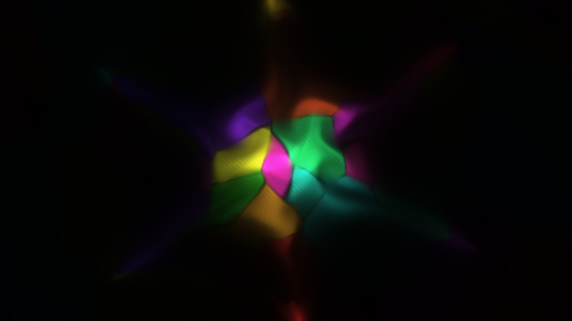
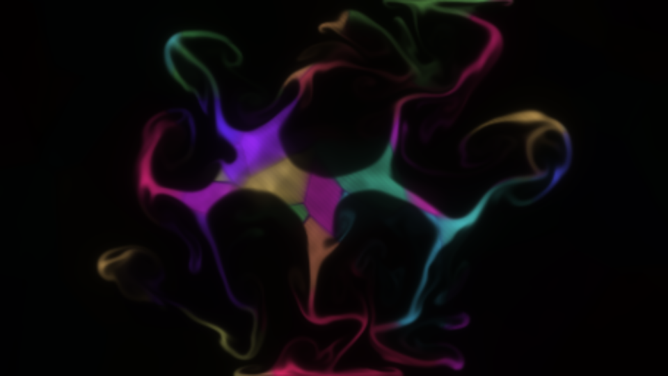
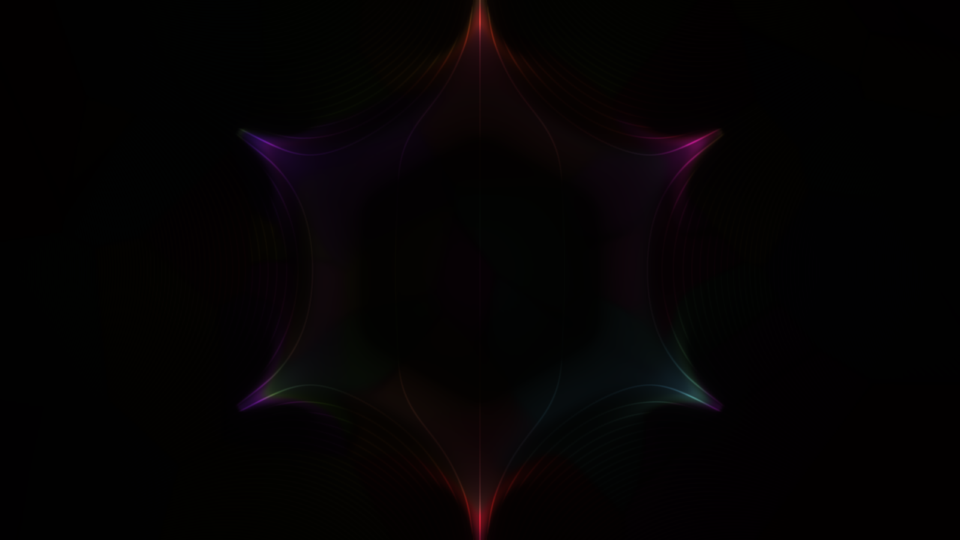
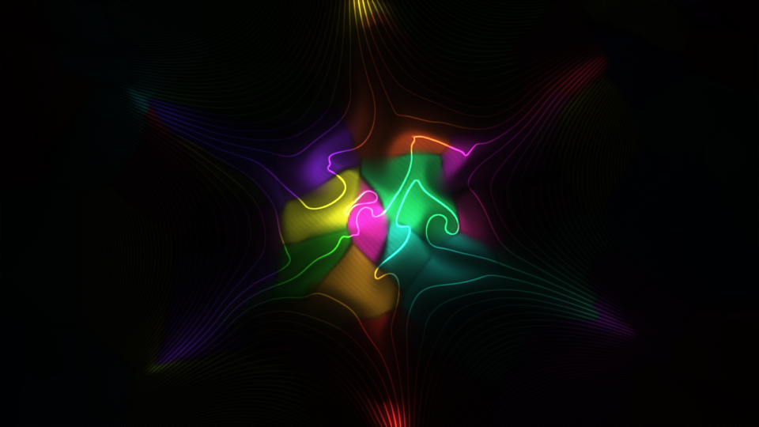
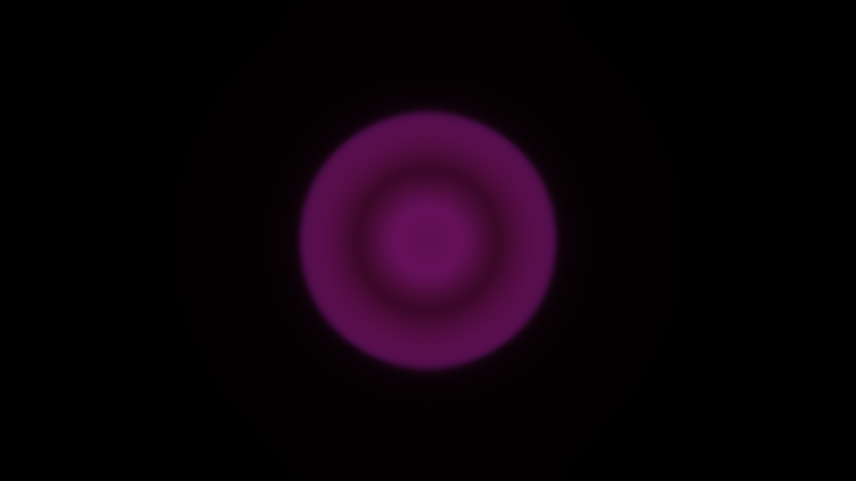

# Containment user guide

Containment is **a ball of hot plasma held in a magnetic bottle, for [Resolume](https://resolume.com)
Arena and Avenue**, as an FFGL effect. Your clip is what the plasma is made of. It is not a
particle system or a painted glow: the plasma obeys the equations of ideal
magnetohydrodynamics, solved on the GPU every frame, and the bottle is the field of real coils
standing outside the picture. The ball swells against the field, rings, writhes, leaks out
through the gaps between the coils and breaks into fingers; switch the coils off and it goes up
as a fireball. None of that is drawn. It all falls out of the one set of equations.


*The Green Orb preset about two Alfvén times after ignition, rendered by the plugin's offline
harness rather than captured from Resolume: the Aurora colour ramp, a six-pole bottle turning
slowly, curvature and stirring just past the point where the edge stays smooth, the glare, and
field lines lit by the plasma sitting on them.*

> **Before you rely on this:** released at **v0.1.0**, and honestly early. The physics is
> measured rather than asserted, by a harness that drives the real plugin class and the shaders
> it compiles, headlessly, and reads each claim back out of the state it made. The Brio–Wu shock
> tube, along either axis, puts all five waves within 0.8 cells of an independent
> double-precision solution; an oblique Alfvén wave travels at B/√ρ to 0.02%; magnetic
> Rayleigh–Taylor fingers grow at the textbook rate to 0.4–0.7%, and do not grow where field-line
> tension says they cannot; a hot ball in a four-, six- or eight-pole bottle leaks within 0.4° of
> the cusp angles the coils predict; the quench fireball's front moves at the exact Riemann
> solution's speed to two cells; mass and energy are conserved to round-off in a closed vessel;
> and eighteen deliberately wrong models, plus a one-character change to a shipped shader, are
> all shown to make those checks fail. All 33 controls are shown to change the picture. It has
> **never been loaded into Resolume on macOS**, and has only been measured on one Mac's GPU
> (Apple M4 Max).
> <!-- WINDOWS -->
> Try it on a spare layer before you put it in a show.
>
> This codebase was created with AI assistance, directed and reviewed by a human author.

---

## Installing

Every download carries one effect, **SW Containment**. Drop it into Resolume's effects folder
and restart Resolume:

```
macOS    ~/Documents/Resolume Arena/Extra Effects/
Windows  %USERPROFILE%\Documents\Resolume Arena\Extra Effects\
```

Avenue uses the same layout under its own folder name. The effect then appears in the effects
browser as **SW Containment**.

The macOS download is a universal build (Apple silicon and Intel), as a `.dmg` or a `.zip`. It is
**Developer ID-signed and notarised**, so the bundle simply loads. The Windows download is an x64
installer or a `.zip`. It is not code-signed, so the installer trips SmartScreen once:
**More info** → **Run anyway**.

It needs a GPU that can render to 32-bit float textures, which every GPU Resolume supports can.

---

## A ball of plasma in a magnetic bottle

A plasma is a gas hot enough that its atoms have come apart into charged particles, and charged
particles cannot cross a magnetic field: they spiral round the field lines. So a field can hold a
plasma the way a bottle holds a gas. That is the whole idea of magnetic confinement, and it is
also why it is hard. Everything below is one term in the equations:

- **The ball** is a region that is hot and dense. It glows as ρ²√T, the way a thin, hot plasma
  radiates (bremsstrahlung), so the tenuous gas around it is almost black.
- **It tries to expand.** Its pressure pushes outwards, and the plasma pushes the field aside and
  piles it up round itself.
- **The field pushes back.** Magnetic pressure and the tension in the field lines hold it. The
  ball settles where its edge sits at **β ≈ 1**, the point where the gas pressure and the
  magnetic pressure balance, and it rings on the way there.
- **It tries to come apart.** The curve of a real bottle's field acts like a gravity pointing out
  of the ball, and a heavy fluid held up by a light one is unstable (Rayleigh–Taylor). The edge
  breaks into fingers, and the field's tension decides which sizes of finger may grow. A
  multipole bottle has gaps between its coils — the **cusps** — and the plasma squirts out through
  them as jets.
- **The fireball.** Quench the coils and nothing holds it: it expands freely, and its front moves
  at the speed the exact solution of that problem gives.

Your clip's colour is frozen into the plasma and carried with its mass, so the clip is smeared,
stretched and folded by the flow. With **Feed** up, the live clip keeps flowing into the ball, so
the picture inside it stays current.

### What the numbers mean

Inside, the plugin works in the units plasma physicists use, and some controls speak them:

- **Distance:** the frame's height is 1.
- **Field:** in units of a reference field. Field 1 is the reference.
- **Time:** the **Alfvén time**, written τ_A: how long a magnetic wave takes to cross the frame
  at the reference field and density. **Speed** says how many of those pass per second.
- **β (beta):** gas pressure over magnetic pressure. Below 1 the field wins; above 1 the gas does.
  **Temperature** is the ball's β.

---

## Start here

Put SW Containment on a clip or a layer. The defaults are the **Clip Orb**: a ball of your clip,
a fifth of the frame across, held by a uniform field along the axis and shaped by a weak six-pole
bottle whose coils turn slowly, stirred and curved just past the point where its edge stays
smooth, fuelled so it never runs down, in a closed vessel. It lights the moment the effect loads.



*The defaults over the harness's test card, 1.2 Alfvén times after ignition: the card's colour
patches frozen into the plasma and folded by the flow, the six faint jets of the cusp, and the
dark field around it. Rendered by the offline harness.*

Then:

1. **Press Ignite.** A fresh ball, cut from whatever the clip is showing now. Move **Ball X** and
   **Ball Y** first to light it somewhere else.
2. **Curvature up, towards 0.7.** The ball's edge breaks into fingers. This is the "decompose"
   control.
3. **Guide Field down to 0.** Only the cusp is left holding it, and the ball squeezes out through
   the six gaps between the coils. **Poles** changes how many gaps.
4. **Press Pellet.** A lump of cold, dense fuel drops into the middle, and the ball has to share
   its motion with it.
5. **Quench on.** The coils let go and the ball goes up as a fireball. Turn it off and they come
   back; press Ignite for another ball.
6. **Preset → Green Orb.** The same bottle turning faster and stirred harder, in the oxygen green
   of the Aurora ramp, with the glare and field lines. While a preset is chosen it owns most of the
   sliders above; set Preset back to **Custom** to play with them again.

**Changing a control does not re-ignite**, except Preset, Detail and Boundary. The ball you
have carries on under the new field, which is usually the interesting part: turn Field up and watch it get squeezed.
Ignite to start clean.

Every slider is declared to the host as 0 to 1, so the host only knows its position. The value
each position stands for is given with each control below.

---

## The presets

**Preset** is at the top. **Custom** means the controls are the truth. Any other row lays a whole
bottle over the controls it owns, and **choosing one re-ignites**. Resolume cannot be told to move
its own sliders, so while a preset is chosen the inspector keeps showing your own values for the
columns the preset owns, and those sliders do nothing until you go back to Custom. A preset
leaves alone where the ball is, Detail, Speed, the audio, View and Mix.

| Preset | What it is |
| --- | --- |
| **Clip Orb** | The defaults, exactly: the clip's own colours. |
| **Green Orb** | The same bottle turning faster and stirred harder, in the Aurora green, with glare and field lines. |
| **Guide Field Bubble** | A top-hat ball in a uniform axial field and nothing else. It swells, rings and settles into a pressure-balanced bubble; while it rings, its edge fingers. |
| **Cusp Leak** | A hot ball in a six-pole bottle with no guide field, in an **Open** vessel: it squirts out along the six field lines that lead out, and the fuel keeps it squirting. |
| **Rayleigh-Taylor** | Strong curvature on a guide-field ball: nothing in the plane holds the edge, so it breaks into fingers and mushrooms. |
| **Quench Fireball** | The coils off and a very hot ball in an Open vessel: it free-expands and leaves the frame. Press Ignite for another. |



*The Rayleigh-Taylor preset two Alfvén times after ignition. Rendered by the offline harness.*



*Cusp Leak early on: the six jets leave at the cusp angles, with the field lines lit where plasma
runs along them. Rendered by the offline harness.*

**Cusp Leak runs slow.** With no guide field and Open's hidden margin, the field at the grid's
corners is strong, so the step the solver may take is short, and the preset hits the limit of 48
steps a frame on every frame. Simulated time then runs slower than Speed asks (it never goes
unstable), and it costs more than the default. See **Performance**.

---

## The Ball group

**Ignite** — lays down a fresh ball of the size, position, temperature and profile below, coloured
by the clip as it is at that moment, and clears away the old one. Everything else in the vessel
is reset to still, cold background at the bottle's own field.

**Ball Size** — the ball's radius, from **0.04 to 0.4 frame heights**, linearly. Default **0.389,
a radius of 0.18**. For the Gaussian profile it is the radius at which the ball has fallen to 1/e;
for the top hat, its edge. It shapes the next Ignite, and the footprint Fuel tops up.

**Ball X / Ball Y** — where the ball is lit, as a point on the frame; the middle by default. The
bottle does not move with it: a ball lit off-centre sits in a different part of the field. The
next Ignite lights it there, and Fuel, Pellet, the curvature and the stirring all centre on this
point at once, so moving it with a ball already lit drags the fuel and the pull away from the
plasma.

**Temperature** — the ball's β against the reference field, from **0.1 to 50**, on a logarithmic
slider. Default **0.315, a β of 0.71**. A cool ball (β well below 1) is held easily; a hot one
pushes the field a long way aside, swells, and leaks harder. It sets the ball's pressure at the
next Ignite, and the pressure Fuel tops up towards.

**Profile** — **Gaussian** (the default), a soft ball, or **Top Hat**, a ball with a sharp edge.
A top hat rings harder and its edge fingers while it rings. It shapes the next Ignite and
Fuel's footprint.

**Pellet** — drops a small lump of cold, dense plasma (twice the reference density, 0.035 frame
heights across) at the ball's centre. It is heavy, so the flow has to carry it, and it cools the
middle.

**Feed** — how fast the live clip keeps flowing into the ball, as the fraction of the way the
plasma's colour moves towards the clip in one frame at 60 fps: **0 to 1**. Default **0.1**. At 0
the ball keeps the picture it was lit with and the flow folds that picture ever finer; at 1 the
ball is repainted with the live clip every frame and only its shape comes from the plasma.

**Clip Heats** — **0 to 1**, off by default. The bright parts of the picture are hotter: at 1
the brightest pixel starts at twice the ball's pressure and the darkest at none, so bright parts
of the clip burst outwards and dark ones collapse. After ignition it keeps heating the plasma
through Feed, in proportion to both, so with Feed at 0 it acts only at Ignite.

**Fuel** — a steady puff of gas that tops the ball's footprint back up towards its ignition
profile, from **0 to 2 per Alfvén time**, linearly. Default **0.15, a rate of 0.3**. It only adds,
at rest, never removes, so it holds a leaking ball up without pinning it in place. At 0 an Open
bottle runs down and the ball drains away.

---

## The Bottle group

**Field** — the bottle's strength, from **0.25 to 4 times the reference field**, on a logarithmic
slider. Default **0.25, a field of 0.5**. For a multipole bottle it is the field strength halfway
from the centre to the top of the frame. Turn it up and the same ball is squeezed harder: it
shrinks, rings faster, and the whole simulation needs shorter steps (see **Performance**).

**Guide Field** — the uniform field along the axis, straight out of the screen, as a multiple of
Field: **0 to 2**, linearly. Default **0.7, which is 1.4 × Field**. This is what really holds the
default ball: plasma cannot cross it, and it adds magnetic pressure all round. At 0 only the
multipole holds the ball, and it drains through the cusps in about one and a half Alfvén times.
A guide field has no field lines in the picture's plane, so it draws none.

**Poles** — the number of coils round the frame: **0, 4, 6, 8 or 12**, of alternating current.
Default **6**. 0 is the guide field alone. More poles make a flatter-bottomed bottle with more,
narrower cusps.

**Coil Radius** — how far out the coils stand, from **1.1 to 3 frame heights** from the centre,
linearly. Default **0.105, a radius of 1.3**. The coils are never allowed inside the picture: the
plugin pushes them out to at least 1.05 times the distance to the frame's corner. Further out,
the multipole's field is gentler in the middle, relative to its strength at Field's reference
point.

**Coil Spin** — the coils turning, from **−1 to +1 radians per Alfvén time**, 0 at the middle.
Default **0.55, 0.1 radians per Alfvén time** — at the default Speed, a full turn in about three
and a half minutes. The plasma has to follow the field, so the cusps and their jets sweep round.

**Curvature** — the pull outwards that a real bottle's curved field lines exert, standing in for
geometry a flat picture does not have. From **0 to 3**, rising as the square of the slider.
Default **0.316, a strength of 0.3**. This is the **decompose** control: past a threshold the
ball's edge is unstable and breaks into fingers. Its pull is strongest where the plasma is
hottest, so it acts at the ball's edge rather than on the cold background, and it tapers to
nothing within half the ball's radius of its centre.

**Quench** — a switch. On, the coils lose their current over 0.15 Alfvén times and the ball
free-expands. Off, the current comes back. It does not re-ignite.

**Boundary** — what the edge of the picture is:

- **Wall** (the default) is a perfectly conducting vessel. Nothing crosses it; plasma that reaches
  it is stopped and turned back.
- **Open** is a window onto a bigger bottle. The plugin simulates a hidden margin a tenth of the
  frame's height deep all round, where anything leaving is gently absorbed, so plasma and waves
  leave the picture and do not come back. About 12% of a slow wave meeting the edge at a slant
  echoes once, then leaves. **Open costs more** (about 13–16 ms a frame at 1080p against Wall's 8
  on the machine it was measured on), which is why Wall is the default.

Switching between them re-ignites, because Open's hidden margin changes the grid.

---

## The Plasma group

**Speed** — how fast simulated time runs, in **Alfvén times per second**, from **0.02 to 2** on a
logarithmic slider, and **exactly 0 at the bottom**, which freezes the plasma where it is.
Default **0.588, a speed of 0.3**.

**Resistivity** — lets the field leak into the ball, a slow failure of containment: **0 (off, the
default), then 1e-5 to 1e-2**, logarithmic. At the top the field diffuses across the frame in
about a hundred Alfvén times, so it acts over a long clip, not a beat.

**Cooling** — the ball loses heat by radiating, as it would: **0 to 8**, rising as the cube of the
slider. Off by default. A cooling ball dims and shrinks, and the field closes in.

**Detail** — the size of the simulation grid, in cells across the frame's short side: **128, 256
(the default), 512 or 1024**. The grid, not your composition's resolution, sets the cost and the
fineness of the fingers. See **Performance**: only 128 and 256 run in real time on the machine it
was measured on. Changing Detail re-ignites, because the grid is rebuilt.

**Drive** — a slow, random stirring about the ball, from **0 to 4**, rising as the square of the
slider. Default **0.274, a strength of 0.3**. The stirring is built so it never compresses the
plasma, only swirls it, and it is confined to about one and a half ball radii round the ball, so
the background stays still.

**Drive Scale** — the size of the stirring's swirls, from **0.05 to 0.6 frame heights**, on a
logarithmic slider. Default **0.442, about 0.15**.

---

## The Audio group

**Audio** — Resolume's FFT input.

**Audio Heat** — heats the ball with the music's level: **0 to 4**, as heating power at full
level. Off by default. Loud passages swell the ball and push it against the field.

**Audio Pellets** — fires a Pellet on each onset (a hit in the music). The slider is the
detector's sensitivity; 0, the default, is off.

Both are untested against real audio in a host: the plugin assumes Resolume's 64 FFT bands are
spread evenly from 0 Hz to half the sample rate, which nobody in the fleet has measured.

---

## The Light group

**Exposure** — the camera's exposure, from **−4 to +8 EV**, linearly. Default **0.4167, +1 EV**.
0 EV puts a reference ball (the reference density at a quarter of the reference temperature) at
white. A hot ball is very bright and a cold one dim, as a real plasma is.

**Temperature Tint** — **0 to 1**, off by default. 0 is your clip's own colours; 1 replaces them
with the temperature Ramp, so hotter plasma is a different colour, not only brighter.

**Ramp** — the temperature colours:

- **Hot** (the default): deep red, through violet, to white.
- **Aurora**: the green of oxygen's 557.7 nm line, the colour of the aurora, going white-green
  where it is hottest.

**Glow** — a camera's glare, from **0 to 0.9**: the fraction of the light that is spread out of
the bright core into three soft halos of increasing size. Default **0.333, a fraction of 0.3**.
It moves light rather than adding any, so turning it up makes the halo brighter and the core
dimmer by the same amount.

**Field Lines** — draws the field's lines in the picture's plane as thin contours, **0 to 1**
brightness, off by default. They are **lit by the plasma sitting on them**, so they show where the
plasma is and fade into the dark elsewhere. Lines closer than two pixels apart fade out rather
than filling the picture. The guide field has no lines in the plane, so a bottle with Poles 0 has
none.

**Field Line Count** — how many lines span the bottle's field, from **4 to 48**. Default **0.273,
16 lines**.



*Field Lines at 0.8 over the defaults. Rendered by the offline harness.*

**View** — what is shown: the **Picture** (the default), or a false-colour map of one of the
simulation's quantities: **Density**, **Pressure**, **|B|** (field strength), **β**, **Speed**
(the flow's) and **∇·B** (the divergence of the field, which should be zero; this shows the
solver's own error, which it keeps near zero). The maps are for seeing what is happening, and a
look in their own right.

**Mix** — the plasma's light against your untouched clip, **0 to 1**, 1 by default. At 0 the
output is your clip exactly, pixel for pixel. The plasma keeps running underneath whatever Mix
says.

---

## Time

The simulation advances by Speed × the host's elapsed time each frame, so the same settings give
the same motion at 30 fps and at 60. Inside a frame it takes as many short steps as the plasma
needs to stay stable: each step is limited by the fastest wave anywhere in the grid, and the
fastest waves are where the field is strongest. At the defaults that is about 22 steps a frame.

A frame may take **at most 48 steps**. If the plasma needs more than that — a strong Field at a
high Speed, a fine Detail, Cusp Leak — **simulated time runs slower than Speed asks, never
unstable**. The picture carries on smoothly; it just moves slower than the number says. The
plugin's log records when that happens.



*Quench Fireball, a fraction of an Alfvén time after ignition: the hot ball already free-expanding,
its front a ring. Rendered by the offline harness.*

---

## How it works

The plasma lives in four floating-point textures on the GPU, holding the density, momentum,
energy, magnetic field, a divergence-cleaning field, an entropy, and the plasma's colour. Every
step runs six passes:

1. **Reduce** the grid to its fastest wave speed.
2. **Clock:** choose the step from it (a Courant number of 0.8), without a round trip to the CPU.
3. **Predict** half a step with limited slopes (MUSCL–Hancock).
4. **Flux** across every vertical face, then **flux** across every horizontal one, with the HLLD
   Riemann solver (Miyoshi and Kusano) and GLM divergence cleaning (Dedner).
5. **Update** every cell from its faces' fluxes, plus the curvature, the stirring, the fuel,
   cooling and the boundary.

Where the field dominates and the gas is thin, the gas pressure is a tiny difference of large
numbers; there the plugin takes it from an entropy carried with the flow instead (a dual-energy
switch), and elsewhere energy decides. The bottle's field is the closed-form field of the coils,
computed exactly, and the lines drawn by Field Lines come from a potential solved once a frame.

The light is the plasma's own emission, ρ²√T times its colour, then the glare, the field lines,
exposure and a soft shoulder that rolls highlights off rather than clipping them.

Some parts are modelling choices rather than textbook ideal MHD, and the repository's AGENTS.md
says why each is there: the dual-energy switch, the energy the cleaning gives back, the coils'
changes carried through the vessel, curvature scaled by temperature, Open's absorbing margin, and
Fuel. It is 2.5-D: nothing varies along the axis, so there are no kinks and no tokamak.

---

## Performance

Measured by the offline harness on an Apple M4 Max at the default look, in milliseconds per
frame:

| Detail | 720p | 1080p | 4K |
| --- | --- | --- | --- |
| 128 | 3.5 | 3.3 | 3.4 |
| 256 (default) | 8.1 | 8.1 | 8.4 |
| 512 | 58 | 54 | 55 |
| 1024 | 205 | 209 | 215 |

**The grid sets the cost, not the resolution.** The default holds 60 fps at 1080p with half the
frame to spare. Detail 512 and 1024 are not real-time there, and at 1024 the 48-step limit bites
as well, so simulated time also runs slow. **Open** costs more than Wall (about 13–16 ms at 1080p
for the default look), and anything that makes the field stronger at the corners (a high Field,
no guide field, Cusp Leak) costs more steps. Nothing was timed inside Resolume, and nothing was
timed on a Windows GPU.

---

## If it looks wrong

**It is black.** The ball may have drained away: an Open bottle with no Fuel runs down, and so
does a ball with Cooling up. Press Ignite. Check Mix and Exposure.

**Nothing moves.** Speed is at 0, which freezes the plasma. Or the ball has settled: raise
Curvature or Drive.

**It moves slower than Speed says.** The 48-step limit is biting: lower Field, lower Detail, go
back to Wall, or give it a guide field. See **Time**.

**A slider does nothing.** A preset is chosen and owns that column: set Preset to Custom. Or it
is one that mostly acts at the next Ignite: Ball Size, Temperature and Profile (they also shape
what Fuel tops up, so with Fuel at 0 they wait for Ignite). The Bottle group acts at once.

**Field Lines shows nothing.** Poles is 0 (a guide field has no lines in the plane), or there is
no plasma on the lines to light them.

**The ball keeps its first picture.** Feed is at 0. Raise it for the live clip.

**It costs too much.** Detail 128, Wall, a guide field, and a gentler Field.
